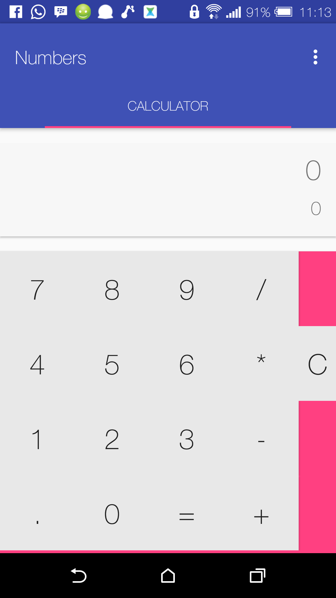
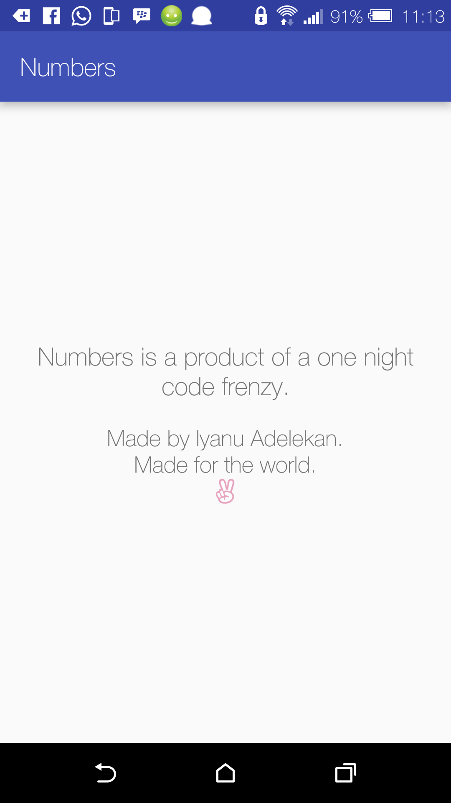

<link rel="stylesheet" href="README.css">
# Numbers-Calculator
An open source Android project for new android developers
## Aim of project
To demonstrate basic android programming concepts to people of all objectives
## Concepts demonstrated
- Creation of layouts with XML
- The creation and usage of Activities
- The creation and usage of Fragments
- The creation and usage of ViewPagers
- Passing of Objects among Fragments via references
- Starting new Activities with Intents

## Installation
- Download or clone this project
- Import project to your IDE of choice
- Build project to APK or install bundled APK

## Your tasks
### Consider the screen below

- Are there any fragments present? If so, how many?
- From your observation of the code in MainActivity.java
is there a better way to have created this screen?
- Does the current form of the app implement the full functionality
intended by the original author?
- If it doesn't, implement the remaining functionalities intended.

### Consider the class BasicKeyInit
- Were the methods written in the best possible way? If not, why?
Rewrite the method constructs in a more meaningful way.

### Consider EvaluationCore.java
- What is its purpose?
- Rewrite the class in a better way.

### About this project

## License
The MIT License (MIT)

Copyright (c) 2016 Iyanu Adelekan

Permission is hereby granted, free of charge, to any person obtaining a copy
of this software and associated documentation files (the "Software"), to deal
in the Software without restriction, including without limitation the rights
to use, copy, modify, merge, publish, distribute, sublicense, and/or sell
copies of the Software, and to permit persons to whom the Software is
furnished to do so, subject to the following conditions:

The above copyright notice and this permission notice shall be included in all
copies or substantial portions of the Software.

THE SOFTWARE IS PROVIDED "AS IS", WITHOUT WARRANTY OF ANY KIND, EXPRESS OR
IMPLIED, INCLUDING BUT NOT LIMITED TO THE WARRANTIES OF MERCHANTABILITY,
FITNESS FOR A PARTICULAR PURPOSE AND NONINFRINGEMENT. IN NO EVENT SHALL THE
AUTHORS OR COPYRIGHT HOLDERS BE LIABLE FOR ANY CLAIM, DAMAGES OR OTHER
LIABILITY, WHETHER IN AN ACTION OF CONTRACT, TORT OR OTHERWISE, ARISING FROM,
OUT OF OR IN CONNECTION WITH THE SOFTWARE OR THE USE OR OTHER DEALINGS IN THE
SOFTWARE.

